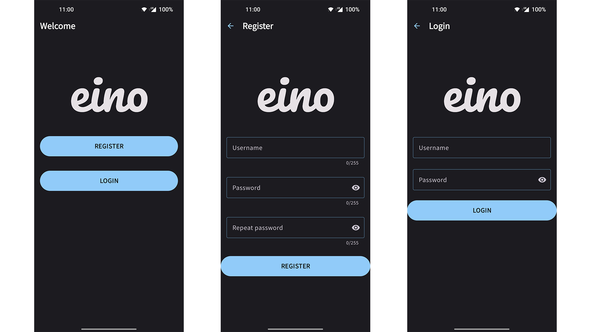
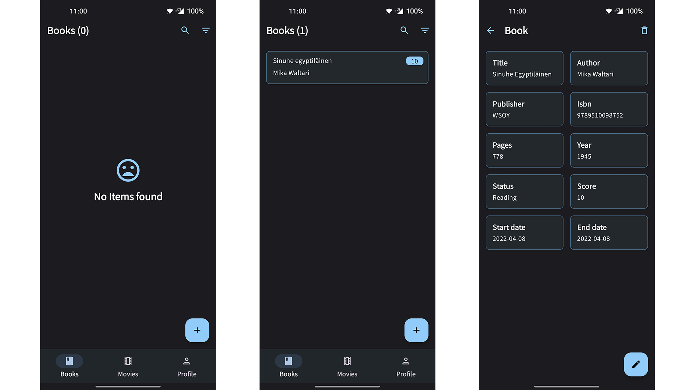
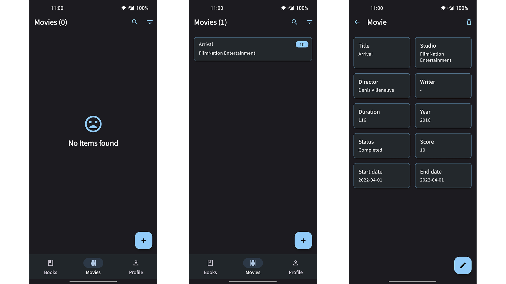
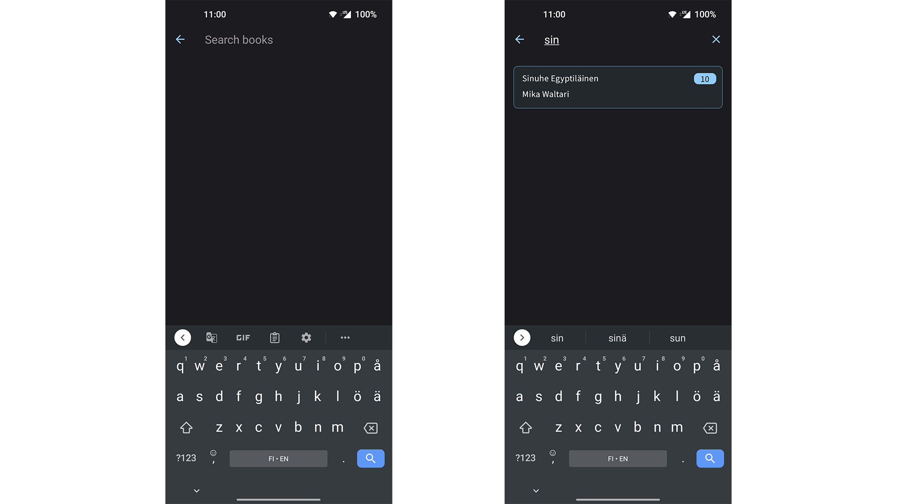
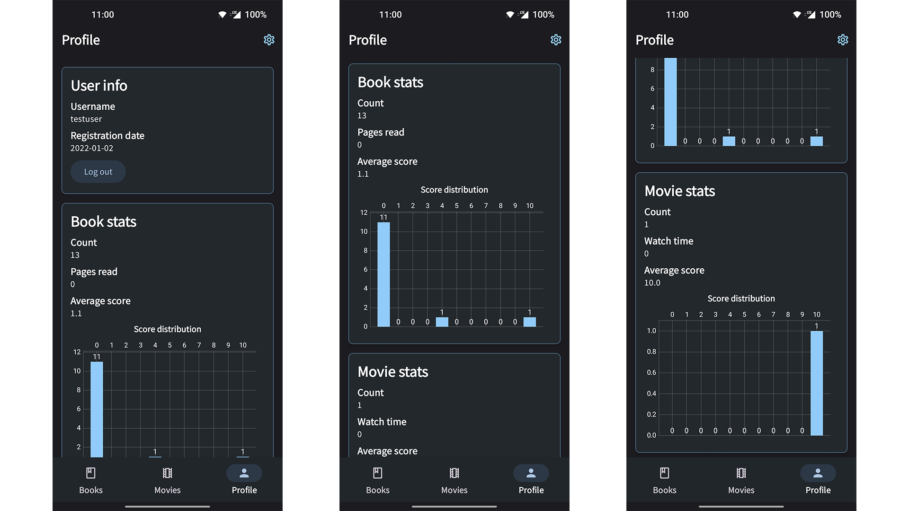
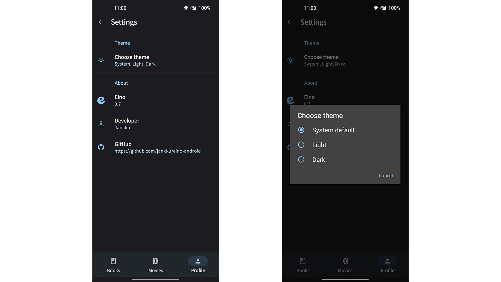

<div style="text-align: center;">

<h1>Eino</h1>
<p>Book and movie tracker with web and Android clients.</p>
<p>You can find backend code <a href="https://github.com/jankku/eino-backend/">here</a> and web frontend
code <a href="https://github.com/jankku/eino-web/">here</a>.</p>
</div>


## Building

Create `baseurl.properties` file to root folder with the following content:

```properties
baseUrl="<backend url>"
```

And then build the project.

## Screenshots

### Authentication


### Books


### Movies


### Search


### Profile


### Settings
